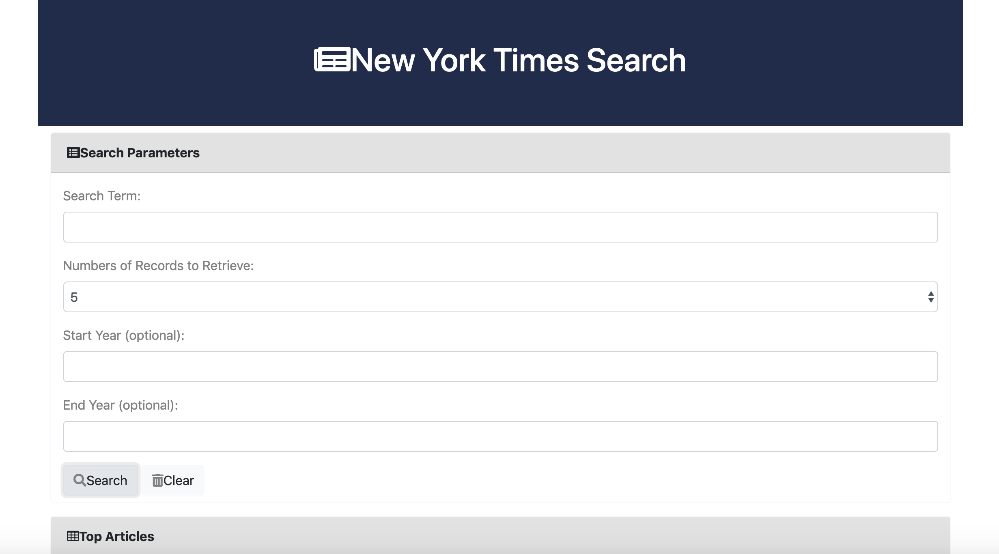

#  **New York Times Article** #
[Deployed Link](https://charrmountain.github.io/NYTsearch/)

## **Description**

-  User is able to search all New York Times articles through a key word. User can pick "Start Year" and "End Year". User can select between 1 , 5 , and 10 articles to be displayed on the page.

    - ### **HTML pages:**
         1. [index.html](index.html) is the main home page for New York Times articles.
         2. [home-script.js](portfolio.html) is the JavaScript for script to make page run correctly.

    - ### **Style Sheets** (used on all HTML pages)**:**
         1. [Bootstrap](https://getbootstrap.com/Bootstrap)

## **Usage**

- Search through all New York Times articles!

## **Support**
- e-mail: charr.mt@gmail.com
- https://github.com/charrmountain/NYTsearch